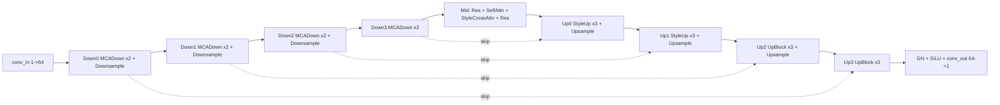

# DiffuFont 模型结构说明（SourcePartRefUNet）

## 1) 这是标准做法吗？

结论：**主干是标准 diffusion U-Net 做法**，并加入了条件注入增强。

- 标准部分：U-Net 编解码结构、下采样/上采样、跨层 skip concat、ResNet block、time embedding。
- 扩展部分：
  - 下采样与中间层加入内容条件注入（`ChannelAttnBlock`）。
  - 下采样/中间层/前两级上采样加入 style/part token 的 cross-attention。
  - 条件 token 由 `part encoder` 与 `style encoder` 生成（`part_style` 时拼成 2-token 序列）。

对应代码：
- 顶层组网：`models/source_part_ref_unet.py`
- U-Net 主干：`models/source_fontdiffuser/unet.py`
- 各 block：`models/source_fontdiffuser/unet_blocks.py`
- ResNet/上下采样：`models/source_fontdiffuser/resnet.py`
- Transformer/CrossAttention：`models/source_fontdiffuser/attention.py`

---

## 2) 总体数据流（含条件分支）

```mermaid
flowchart TD
    X0[Target x0 256x256] -->|bilinear to 128| XL[x0_latent 1x128x128]
    XT[x_t latent + timestep t] --> U

    C[content_img 1x128x128] --> CE[ContentEncoder]
    CE --> CR[content residuals: r0,r1,r2,r3]

    P[part_imgs BxPx1x64x64 + mask] --> PE[Part patch encoder]
    PE --> PS[masked sum pool + LN]
    PS --> PT[part token Bx1x256]

    S[style_img 1x128x128] --> SE[Style image encoder + LN]
    SE --> ST[style token Bx1x256]

    PT --> CAT
    ST --> CAT
    CAT{conditioning mode}
    CAT -->|part_only| TOK1[Bx1x256]
    CAT -->|style_only| TOK2[Bx1x256]
    CAT -->|part_style| TOK3[Bx2x256 [part,style]]
    CAT -->|baseline| TOK0[None]

    XL --> U[UNet backbone]
    CR --> U
    TOK1 --> U
    TOK2 --> U
    TOK3 --> U
    TOK0 --> U

    U --> Y[eps_hat / v_hat 1x128x128]
```

---

## 3) 条件编码器结构（卷积层明细）

### 3.1 Part patch encoder（每个 part 图像）

输入：`(B*P, 1, 64, 64)`

1. `Conv2d(1, 64, k3, s2, p1, bias=False)`
2. `BatchNorm2d(64)`
3. `SiLU`
4. `Conv2d(64, 128, k3, s2, p1, bias=False)`
5. `BatchNorm2d(128)`
6. `SiLU`
7. `Conv2d(128, 256, k3, s2, p1, bias=False)`
8. `BatchNorm2d(256)`
9. `SiLU`
10. `AdaptiveAvgPool2d(1)`
11. `Flatten`
12. `Linear(256, 256)`
13. `LayerNorm(256)`（逐 token）
14. mask 位置清零
15. DeepSets masked sum pooling 得到 `(B,256)`
16. `LayerNorm(256)` 得到 part 向量
17. `unsqueeze(1)` 得 part token `(B,1,256)`

### 3.2 Style image encoder

输入：`(B,1,128,128)`

1. `Conv2d(1, 64, k3, s2, p1, bias=False)`
2. `BatchNorm2d(64)`
3. `SiLU`
4. `Conv2d(64, 128, k3, s2, p1, bias=False)`
5. `BatchNorm2d(128)`
6. `SiLU`
7. `Conv2d(128, 256, k3, s2, p1, bias=False)`
8. `BatchNorm2d(256)`
9. `SiLU`
10. `AdaptiveAvgPool2d(1)`
11. `Flatten`
12. `Linear(256, 256)`
13. `LayerNorm(256)`
14. `unsqueeze(1)` 得 style token `(B,1,256)`

### 3.3 token 组合规则

- `baseline`：`None`
- `part_only`：`[part]` -> `(B,1,256)`
- `style_only`：`[style]` -> `(B,1,256)`
- `part_style`：`torch.cat([part, style], dim=1)` -> `(B,2,256)`

---

## 4) UNet 主干完整结构（默认配置）

默认关键参数（来自 `SourcePartRefUNet`）：

- `sample_size=128`, `in_channels=1`, `out_channels=1`
- `block_out_channels=(64,128,256,512)`
- `down_block_types=(MCADownBlock2D x4)`
- `up_block_types=(StyleUpBlock2D, StyleUpBlock2D, UpBlock2D, UpBlock2D)`
- `layers_per_block=2`（因此 up block 是 `num_layers=3`）
- `cross_attention_dim=256`, `attention_head_dim=1`
- `content_start_channel` 传给 UNet 时为 `32`

### 4.1 输入与时间嵌入

1. `conv_in: Conv2d(1, 64, k3, p1)`
2. `time_proj: Timesteps(64)`
3. `time_embedding: TimestepEmbedding(64 -> 256)`

### 4.2 下采样路径（4 个 MCADownBlock2D）

每个 MCADown block（每层）执行：

1. `ChannelAttnBlock`（内容注入）
2. `ResnetBlock2D`（First ResBlock）
3. `SelfAttentionBlock`（SpatialTransformer）
4. `StyleCrossAttentionBlock`（context 为 style/part token；可选）
5. `ResnetBlock2D`（Post ResBlock）
6. block 末尾可选 `Downsample2D(stride=2, conv3x3)`

#### Down-0 (128x128, ch=64)
- 两层均在 64 通道上运行。
- 内容注入点存在但 `current_content_feature=None`（显式跳过）。
- 末尾下采样到 `64x64`。

#### Down-1 (64x64, 64->128)
- 内容注入使用 `content_residual_features[1]`（64x64）。
- Layer1: ResNet `64->128`，attn 在 128 通道。
- Layer2: ResNet `128->128`，attn 在 128 通道。
- 末尾下采样到 `32x32`。

#### Down-2 (32x32, 128->256)
- 内容注入使用 `content_residual_features[2]`（32x32）。
- Layer1: ResNet `128->256`，attn 在 256 通道。
- Layer2: ResNet `256->256`，attn 在 256 通道。
- 末尾下采样到 `16x16`。

#### Down-3 (16x16, 256->512)
- 内容注入使用 `content_residual_features[3]`（16x16）。
- Layer1: ResNet `256->512`，attn 在 512 通道。
- Layer2: ResNet `512->512`，attn 在 512 通道。
- 无下采样（最底层）。

### 4.3 Mid Block（UNetMidMCABlock2D）

结构：

1. `ResnetBlock2D(512->512)`
2. `content_attn`（此项目配置 `mid_enable_content_attn=False`，所以是 passthrough）
3. `SelfAttentionBlock(512)`
4. `StyleCrossAttentionBlock(512, context_dim=256)`
5. `ResnetBlock2D(512->512)`

### 4.4 上采样路径（4 个 up block）

上采样每层都会先做 U-Net skip concat：

- 从 `down_block_res_samples` 弹出一份 `res_hidden_states`
- `torch.cat([hidden_states, res_hidden_states], dim=1)`
- 再进当前层的 ResNet/Attention

#### Up-0: `StyleUpBlock2D`（16->32, out=512, 3层）
每层：`Resnet -> SelfAttn -> StyleCrossAttn -> PostResnet`
- 3 层 ResNet 输入通道分别：`1024, 1024, 768`，输出均 `512`
- 末尾 `Upsample2D` 到 `32x32`

#### Up-1: `StyleUpBlock2D`（32->64, out=256, 3层）
- 3 层 ResNet 输入通道：`768, 512, 384`，输出均 `256`
- 末尾 `Upsample2D` 到 `64x64`

#### Up-2: `UpBlock2D`（64->128, out=128, 3层，无 style cross-attn）
- 3 层 ResNet 输入通道：`384, 256, 192`，输出均 `128`
- 末尾 `Upsample2D` 到 `128x128`

#### Up-3: `UpBlock2D`（128, out=64, 3层，最终层）
- 3 层 ResNet 输入通道：`192, 128, 128`，输出均 `64`
- 无上采样

### 4.5 输出头

1. `GroupNorm(64, groups=32, eps=1e-5)`
2. `SiLU`
3. `Conv2d(64, 1, k3, p1)`

---

## 5) 注入点位总览（你关心的重点）

### 5.1 内容条件注入（content feature）

注入模块：`ChannelAttnBlock`

- Down-0：存在注入位，但输入为 `None`，跳过。
- Down-1：注入 `content_residual_features[1]`（64x64）
- Down-2：注入 `content_residual_features[2]`（32x32）
- Down-3：注入 `content_residual_features[3]`（16x16）
- Mid：本配置关闭（passthrough）
- Up：无内容注入

`ChannelAttnBlock` 内部层：
1. concat(input, content) 沿通道拼接
2. `GroupNorm`
3. `SiLU/Mish`
4. `Conv1x1(in->in)`
5. 可选 `SELayer`
6. `GroupNorm`
7. `SiLU/Mish`
8. `Conv1x1(in->out)`（降回主干通道）

### 5.2 style/part token 注入（cross-attention）

注入模块：`StyleCrossAttentionBlock -> SpatialTransformer -> BasicTransformerBlock -> CrossAttention`

开启位置：
- 下采样：4 个 down block * 每 block 2 层 = 8 处
- 中间层：1 处
- 上采样：前 2 个 `StyleUpBlock2D` * 每 block 3 层 = 6 处
- 合计：**15 处 style cross-attention**（在 `attn_scales` 未限制时）

---

## 6) 残差连接与 skip 连接（完整列出）

### 6.1 ResNet 残差

`ResnetBlock2D`：

- 主分支：`GN -> SiLU -> Conv3x3 -> +time_emb -> GN -> SiLU -> Dropout -> Conv3x3`
- 旁路分支：恒等或 `Conv1x1`（通道不匹配时）
- 输出：`(main + shortcut) / output_scale_factor`

### 6.2 Transformer 残差

- `SpatialTransformer`: `proj_in -> transformer -> proj_out + residual`
- `BasicTransformerBlock`: `attn + residual`, `cross_attn + residual`, `ff + residual`

### 6.3 U-Net 跨层 skip

- 下采样路径将每层输出写入 `down_block_res_samples`
- 上采样每层先弹出对应 `res_hidden_states` 并做 `cat`（通道维）
- 这是标准 U-Net encoder-decoder skip concat

---

## 7) 结构图（主干路径）



---

## 8) 关键实现备注

- 这是“标准 U-Net + 条件注入模块”的工程化变体，属于主流可解释设计。
- `part_style` 模式下 token 顺序固定 `[part, style]`，并在 cross-attention 上下文中共享同一 `context_dim=256`。
- `attn_scales` 可限制在哪些分辨率启用 style cross-attn；为空时默认所有尺度启用。

