# Full Model Graph (Current Implementation)

This document describes the current runtime model graph in `conditioning_profile=full` mode.

## 1. End-to-End Graph

```mermaid
flowchart TD
    A0[x_t: noisy target image\nB x 3 x H x W] --> A1[Resize to 96x96]
    C0[content_img\nB x 3 x H x W] --> C1[Resize to 96x96]
    P0[part_imgs\nB x P x 3 x h x w] --> P1[Resize each patch to 96x96]
    PM[part_mask\nB x P] --> PTOK

    C1 --> CE[ContentEncoder Ec]
    CE --> CF0[content_residual_features\nmulti-scale list]

    P1 --> PTOK[Part Tokenizer\nConv->Conv->Conv->GAP->Linear->LN\n+ learnable queries cross-attn]
    PM --> PTOK
    PTOK --> T[T: style tokens\nB x M x D]

    P1 --> PP[Masked part proxy aggregation\nweighted mean over P]
    PM --> PP
    PP --> PE[ContentEncoder Ec on proxy\n(for RSI structure features)]
    PE --> SF[style_content_res_features\nmulti-scale list]

    A1 --> U0[Source UNet]
    CF0 --> U0
    T --> U0
    SF --> U0
    U0 --> O0[out at 96x96]
    O0 --> O1[Resize back to HxW]
    O1 --> OUT[x0_hat]
```

## 2. UNet Stage Graph (Where Token Is Injected)

```mermaid
flowchart LR
    IN[conv_in]
    D0[DownBlock2D\nout:64\nno style token injection]
    D1[MCADownBlock2D\nout:128\nToken Cross-Attn ON]
    D2[MCADownBlock2D\nout:256\nToken Cross-Attn ON]
    D3[DownBlock2D\nout:512\nno style token injection]
    MID[UNetMidMCABlock2D\nToken Cross-Attn ON]
    U0[UpBlock2D\nout:512\nno style token injection]
    U1[StyleRSIUpBlock2D\nout:256\nToken Cross-Attn ON + RSI offset/deform ON]
    U2[StyleRSIUpBlock2D\nout:128\nToken Cross-Attn ON + RSI offset/deform ON]
    U3[UpBlock2D\nout:64\nno style token injection]
    OUT[conv_norm_out -> conv_act -> conv_out]

    IN --> D0 --> D1 --> D2 --> D3 --> MID --> U0 --> U1 --> U2 --> U3 --> OUT
```



## 3. Layer-by-Layer Injection Table

| Stage | Block Type | Main Channel | Token Injection | RSI Injection |
|---|---|---:|---|---|
| Input | `conv_in` | 64 | No | No |
| Down-0 | `DownBlock2D` | 64 | No | No |
| Down-1 | `MCADownBlock2D` | 128 | Yes (style cross-attn context=`T`) | No |
| Down-2 | `MCADownBlock2D` | 256 | Yes (style cross-attn context=`T`) | No |
| Down-3 | `DownBlock2D` | 512 | No | No |
| Mid | `UNetMidMCABlock2D` | 512 | Yes (style cross-attn context=`T`) | No |
| Up-0 | `UpBlock2D` | 512 | No | No |
| Up-1 | `StyleRSIUpBlock2D` | 256 | Yes (style cross-attn context=`T`) | Yes (offset/deform from style structure features) |
| Up-2 | `StyleRSIUpBlock2D` | 128 | Yes (style cross-attn context=`T`) | Yes (offset/deform from style structure features) |
| Up-3 | `UpBlock2D` | 64 | No | No |
| Output | `conv_out` | 3 | No | No |

This corresponds to the five token-injection positions:

1. Down-1  
2. Down-2  
3. Mid  
4. Up-1  
5. Up-2

## 4. Conditioning Profile Switch Behavior

| Profile | Token Path | RSI Path |
|---|---|---|
| `baseline` | Off | Off |
| `token_only` | On | Off |
| `rsi_only` | Off | On |
| `full` | On | On |

When token path is off, all style cross-attn calls are skipped.
When RSI path is off, up-block offset/deform branch is skipped.

## 5. Source Locations

- Wrapper and tokenizer: `models/source_part_ref_unet.py`
- UNet topology: `models/source_fontdiffuser/unet.py`
- MCA + RSI blocks: `models/source_fontdiffuser/unet_blocks.py`
