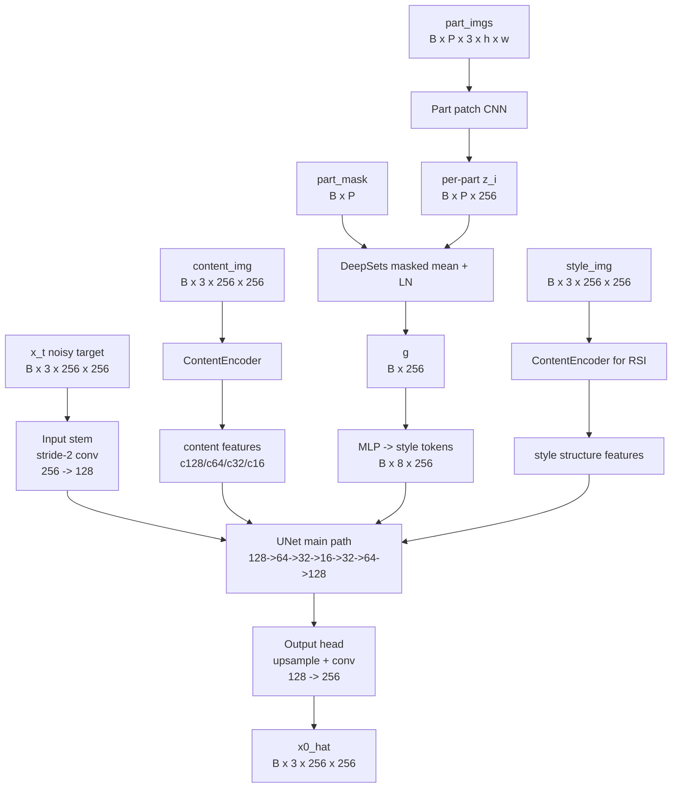

# Full Model Graph (Current Implementation)

This document describes runtime graph in `conditioning_profile=full`.

## 1. End-to-End Graph

## 2. UNet Stage Graph

```mermaid
flowchart LR
    IN[conv_in @128]
    D0[MCADownBlock2D @128\ncontent ON\nstyle attn OFF]
    D1[MCADownBlock2D @64\ncontent ON\nstyle attn OFF]
    D2[MCADownBlock2D @32\ncontent ON\nstyle attn ON]
    D3[MCADownBlock2D @16\ncontent ON\nstyle attn ON]
    MID[UNetMidMCABlock2D @16\ncontent OFF\nstyle attn ON]
    U0[StyleRSIUpBlock2D @16\nstyle attn ON\nRSI ON]
    U1[StyleRSIUpBlock2D @32\nstyle attn ON\nRSI ON]
    U2[UpBlock2D @64\nstyle attn OFF]
    U3[UpBlock2D @128\nstyle attn OFF]
    OUT[conv_norm_out -> conv_act -> conv_out]

    IN --> D0 --> D1 --> D2 --> D3 --> MID --> U0 --> U1 --> U2 --> U3 --> OUT
```

## 3. Layer-by-Layer Injection Table

| Stage | Resolution | Block Type | Content Injection | Style Injection | RSI Injection |
|---|---:|---|---|---|---|
| Stem in | 256->128 | `input_stem` | No | No | No |
| Down-1 | 128 | `MCADownBlock2D` | Yes (`c128`) | No (default scales) | No |
| Down-2 | 64 | `MCADownBlock2D` | Yes (`c64`) | No (default scales) | No |
| Down-3 | 32 | `MCADownBlock2D` | Yes (`c32`) | Yes (`S`) | No |
| Down-4 | 16 | `MCADownBlock2D` | Yes (`c16`) | Yes (`S`) | No |
| Mid | 16 | `UNetMidMCABlock2D` | **No** | Yes (`S`) | No |
| Up-1 | 16 | `StyleRSIUpBlock2D` | No | Yes (`S`) | Yes |
| Up-2 | 32 | `StyleRSIUpBlock2D` | No | Yes (`S`) | Yes |
| Up-3 | 64 | `UpBlock2D` | No | No | No |
| Up-4 | 128 | `UpBlock2D` | No | No | No |
| Head out | 128->256 | `output_head` | No | No | No |

Default style-attn scales are set by `--attn-scales 16,32`.

## 4. Conditioning Profile Behavior

| Profile | Parts Tokens | RSI |
|---|---|---|
| `baseline` | Off | Off |
| `parts_vector_only` | On | Off |
| `rsi_only` | Off | On |
| `full` | On | On |

When parts path is off, all style cross-attention calls are skipped.
When RSI is off, up-block offset/deform branch is skipped.

## 5. Source Locations

- Wrapper / stem-head / parts tokens: `models/source_part_ref_unet.py`
- UNet topology / scale gating: `models/source_fontdiffuser/unet.py`
- MCA + RSI blocks: `models/source_fontdiffuser/unet_blocks.py`
- Online retrieval + parts sampling: `dataset.py`
